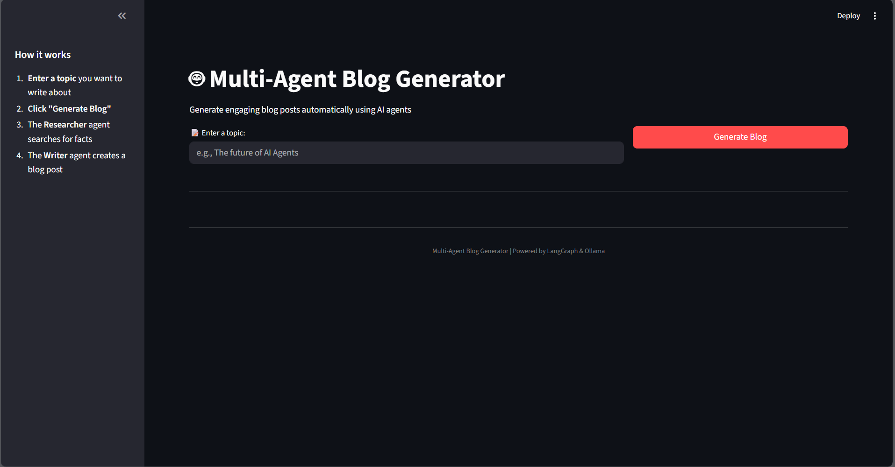
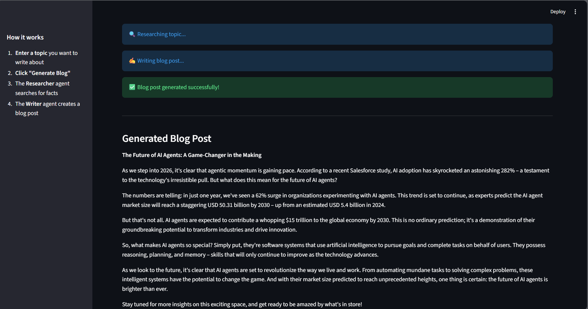

# Multi-Agent Blog Generator

## Overview

A multi-agent system that automatically generates tech blog posts on any topic by combining research and creative writing. The system uses a **Researcher agent** to gather facts and news, and a **Writer agent** to compose an engaging blog post.

This project demonstrates the power of LangGraph for orchestrating multiple AI agents with shared state.

## Architecture

```
Topic Input
    ↓
[Researcher Agent] → Searches web for facts and news
    ↓
[Shared State] → research_data
    ↓
[Writer Agent] → Generates blog post from research
    ↓
Blog Post Output
```

### Agents

1. **Researcher Agent**: Uses DuckDuckGo search to find recent information and facts about the given topic.
2. **Writer Agent**: Uses Ollama (llama3) to write an engaging blog post based on the research data.

## Technologies Used

- **LangGraph**: Multi-agent orchestration and state management
- **LangChain**: Framework for building with language models
- **Ollama**: Local LLM runtime (llama3)
- **DuckDuckGo Search**: Web search for gathering research data
- **Streamlit**: Simple web UI for interaction

## Installation

### Prerequisites

- Python 3.9+
- Ollama installed and running locally

### Step 1: Clone or Download the Project

```bash
cd Multi-Agent\ System
```

### Step 2: Create a Virtual Environment (Optional but Recommended)

```bash
python -m venv langgraph_env
source langgraph_env/bin/activate  # On Windows: langgraph_env\Scripts\activate
```

### Step 3: Install Dependencies

```bash
pip install -r requirements.txt
```

## Running Ollama

1. **Download Ollama** from [ollama.ai](https://ollama.ai)
2. **Start the Ollama service**:
   ```bash
   ollama serve
   ```
3. **Pull the llama3 model** (in a new terminal):
   ```bash
   ollama pull llama3
   ```
4. Keep the Ollama service running while using the agent system.

## Running the Project

### Option 1: Command Line

```bash
python agent.py
```

Expected output:
```
Starting the Multi-Agent System...

Researcher is looking up: The future of AI Agents...
Research complete.
Writer is drafting the post...
Writing complete.

---------------- FINAL OUTPUT ----------------

[Generated blog post here]
```

### Option 2: Streamlit Web UI

```bash
streamlit run ui.py
```

Then open your browser to `http://localhost:8501` and:
1. Enter a topic in the text input
2. Click "Generate Blog"
3. View the generated blog post

## Example

**Input Topic**: "The future of AI Agents"

**Output**:
```
The Future of AI Agents: A New Era of Autonomous Intelligence

In the rapidly evolving landscape of artificial intelligence, autonomous agents 
represent the frontier of intelligent systems. Unlike traditional AI applications 
that respond to user queries, AI agents can independently plan, research, and execute 
tasks with minimal human intervention.

[Full blog post generated from research data...]
```

## Limitations

- **Internet Required**: Researcher agent requires internet access for web search.
- **Ollama Required**: Writer agent requires Ollama running locally with llama3 model.
- **Response Time**: First run may be slow due to model loading; subsequent requests are faster.
- **Quality Varies**: Generated content depends on research data quality and model capabilities.
- **Single Topic**: Current system processes one topic at a time.

## Future Improvements

- Add a fact-checker agent to verify research data
- Implement an editor agent for grammar and style refinement
- Add multi-topic batch processing
- Support for different LLM models
- Add conversation memory for follow-up questions
- Create an API endpoint for integration with other services
- Add analytics to track generated content quality

## Troubleshooting

**Issue**: "Could not find data" error
- **Solution**: Check internet connection; verify DuckDuckGo service is accessible.

**Issue**: Ollama connection refused
- **Solution**: Ensure Ollama is running (`ollama serve`) before starting the app.

**Issue**: llama3 model not found
- **Solution**: Run `ollama pull llama3` in terminal.


## Demo

### App UI


### Generated Blog Output



## License

MIT

## Contributing

Contributions are welcome! Feel free to submit issues or pull requests for improvements.

## Future Work

- Cache research results to avoid repeated web searches and improve response time.
- Add an editor agent to refine and proofread generated blog posts.
- Support multiple LLM backends (e.g., OpenAI, Hugging Face) in addition to Ollama.
- Improve research quality by aggregating results from multiple sources.
- Add persistent storage for generated blogs and research history.


